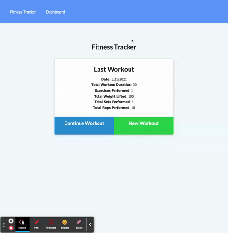

# Fitness Tracker

## Description
A web app that utilizes MongoDB to allow a user to create and summarize their workouts. The user can select between Cardio or Resistance workouts, then use the form to track the name of the workout, the duration, and other pertinent information. 

## Technologies Used
`HTML, CSS, Javascript, MongoDB, Mongoose`

## Links

[Github Repository](https://github.com/thebsking/fitness-tracker)

[Deployed Application](https://shielded-peak-23051.herokuapp.com/)

## Preview

 ## License
 

## Contact
codebybk@gmail.com